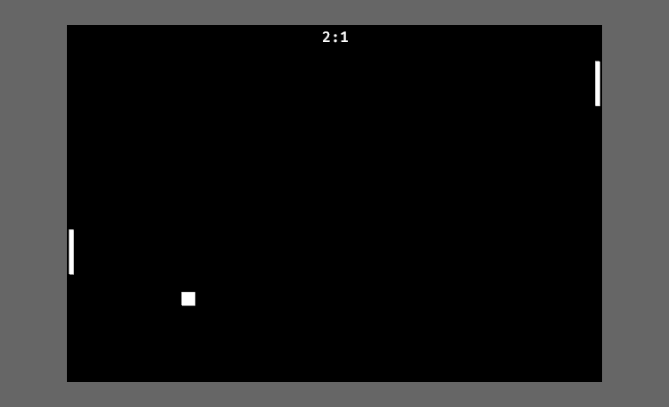

# bevy_pong
bevy_pong is a simple way to create, use and modify the famous classic game "Pong" for the bevy game engine (created for bevy v0.6.1).

## What does it can?
- create a pong game of course
- adjusting the behavior and appearance of the playground, the players and the ball
- optional display of the current player score (on by default)

## Bugs
- sometimes the ball glitches through a player

## How to use it
The easiest way is to add the plugin, this will create a pong game in the middle of the window, where the players can be controlled with 'w' and 's' and the arrow keys 'up' and 'down' respectively (do not forget to add the DefaultPlugins and a camera). Therefore, the minimum necessary code would be something like that:
```rust
use bevy::prelude::*;
use bevy_pong::*;

fn setup(mut commands: Commands) {
    commands.spawn_bundle(OrthographicCameraBundle::new_2d());
}

fn main() {
    App::new()
        .add_plugins(DefaultPlugins)
        .add_plugin(PongPlugin)
        .add_startup_system(setup)
        .run();
}
```

This will result in something like:

### Modification

To change the created game you only need to create and register a 'PongOptions' resource. This resource is divided into:
- GameOptions: changes the __size__, __position__ and __background color__ of the game;
- PlayerOptions: changes the __colors__, __size__, __control keys__ and __speed__ of the players;
- BallOptions: changes the __color__, __size__, __start velocity__ (function, which is always called when the ball is reset), __speedup factor__ (by which the current velocity is mutiplied to speedup the ball) and the __speedup time__ (in seconds);
- ScoreDisplayOptions: modifies the displayed score by changing the __path for the used font__, __font size__ and the __text color__. If `PongOptions.score_display_options` is `Option::None` the default score display won't be used. In case you use the default options, make sure that you have saved the default font "FiraMono-Medium.ttf" in your "assets/fonts" directory.

### Score Display

In case you decide to not use the default score display you can use the emitted `ScoredPointEvent(Player, Score)` to get the player, who gets a point, and their updated score.

## Note

This plugin was not created with a specific focus on efficiency, performance or code quality; it was more about playing around with bevy as a game engine. Many parts of the implementation can undoubtedly be improved (I am neither an expert in Rust nor a bevy veteran, rather the opposite). Therefore it is not recommended for newcomers to use this project as a reference for using rust and bevy.